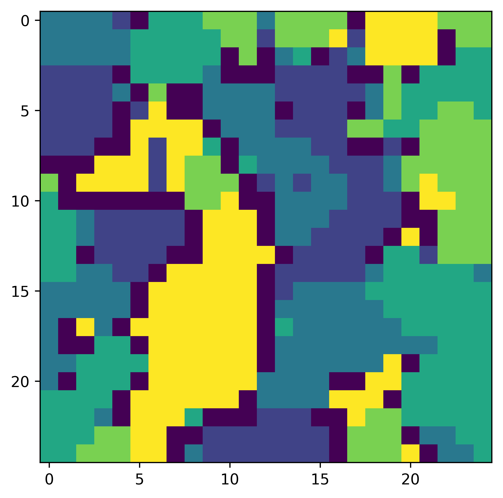

URL link to source code, together with all data necessary to run the program  used in your project, and a short manual describing how to use/run the program.
A sample run, screenshot, or other indication of system behavior (max 1 page).

Tested with Python 3.6.0

Output depends on commands ran. 

